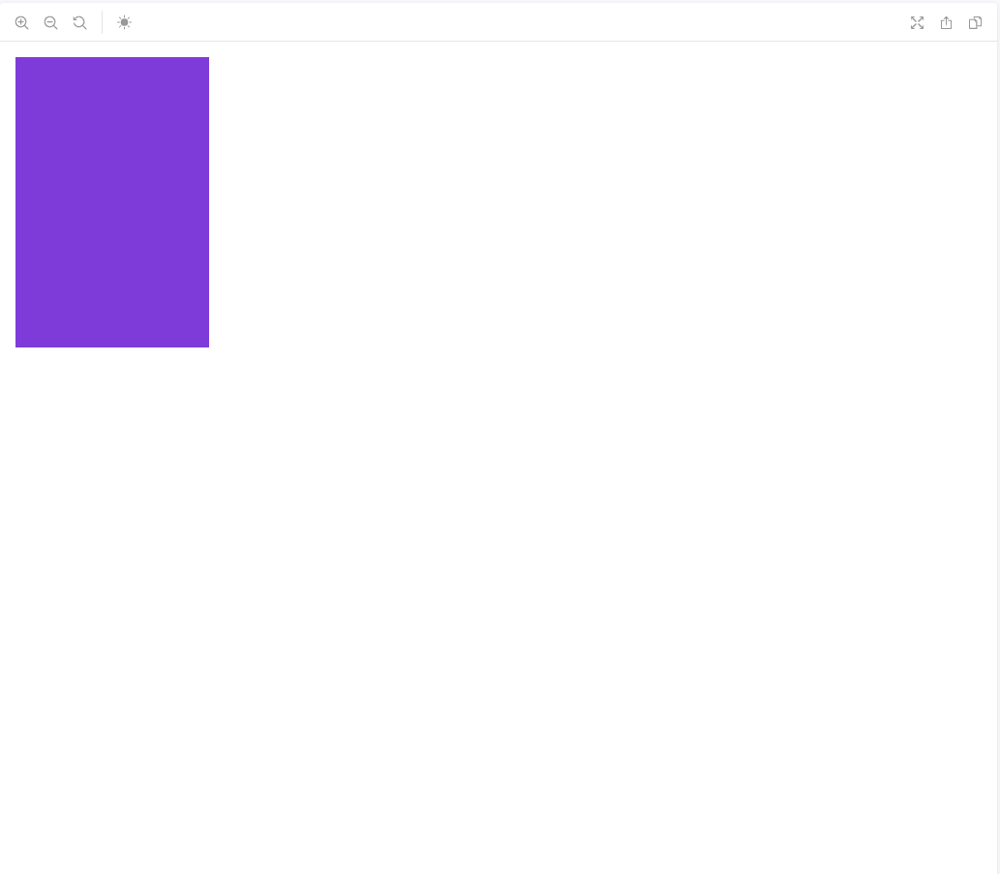
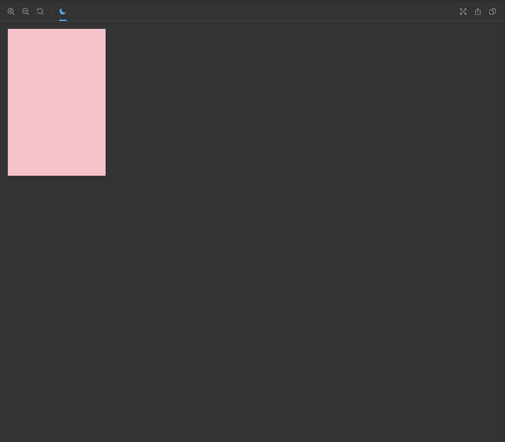

# Storybook Darkmode in Vue 🌙

[](https://www.npmjs.com/package/storybook-darkmode-vue)
[](https://github.com/eddie0329/storybook-darkmode-vue/blob/master/LICENSE)
[](http://makeapullrequest.com)

## ➕ Install

```shell
npm i storybook-darkmode-vue -D
yarn add storybook-darkmode-vue -D
```

## 🎉 Objective

Develop Vue application that provides `darkmode` with Storybook. 

## 💻 Preview

|Light Mode|Dark Mode|
|:-------:|:-------:|
|||

## 🚧 Usage

Use either already made up `DarkModeWrapper`, 

```javascript
// stories
import { storiesOf } from '@storybook/vue';
import DarkModeWrapper from 'storybook-darkmode-vue/DarkModeWrapper';
import DarkModeSample from './DarkModeSample';

storiesOf('Sample', module).add('sample1', () => ({
  data: () => ({}),
  components: {
    DarkModeWrapper,
    DarkModeSample,
  },
  methods: {},
  template: `
    <div>
      <DarkModeWrapper v-slot="{isDarkMode}">
        <DarkModeSample :is-dark-mode="isDarkMode"/>
      </DarkModeWrapper>
    </div>
  `,
}));
```

OR personally make Wrapper.

```javascript
import { addons } from '@storybook/addons'

const channel = addons.getChanel();

channel.on('STORYBOOK_DARK_MODE_VUE, () => {
    // ... 
});

channel.off('STORYBOOK_DARK_MODE_VUE', () => {
    // ...
});
```

## 🔧 Configuration

Need to register as following:

```javascript
// addons.js
import 'storybook-darkmode-vue/register'
```

## 🙇 Contribution

See `CONTRIBUTING.md`.
